# NotePad
This is an AndroidStudio rebuild of google SDK sample NotePad
期中实验
一、实验实现内容
在所给笔记本应用的代码上进一步扩展完成了：NoteList中显示条目增加时间戳显示与添加笔记查询功能（根据标题查询）
附加功能：设置记事本内容字体大小颜色与记事本文件的导出

二、基础功能
1.添加时间戳
1.1在契约类中增加时间戳用
public static final String COLUMN_NAME_MODIFICATION_DATE = "modified";

1.2在noteslist_item.xml加入一个TextView来显示时间戳
<TextView
android:id="@android:id/text2"
android:layout_width="match_parent"
android:layout_height="wrap_content"
android:textAppearance="?android:attr/textAppearanceLarge"
android:gravity="center_vertical"
android:paddingLeft="5dp"
android:maxLines="1" />

1.3在NoteList类的PROJECTION中添加COLUMN_NAME_MODIFICATION_DATE字段
private static final String[] PROJECTION = new String[] {
NotePad.Notes._ID, // 0
NotePad.Notes.COLUMN_NAME_TITLE, // 1
//添加时间戳
NotePad.Notes.COLUMN_NAME_MODIFICATION_DATE,
};

1.4在NoteList类增加dataColumns中装配到ListView的内容，所以要同时增加一个ID标识来存放该时间参数
String[] dataColumns = { NotePad.Notes.COLUMN_NAME_TITLE ,
NotePad.Notes.COLUMN_NAME_MODIFICATION_DATE  } ;
int[] viewIDs = { android.R.id.text1 ,android.R.id.text2};

1.5在NoteEditor类的updateNote方法中获取当前系统的时间，并对时间进行格式化
ContentValues values = new ContentValues();
Long now = Long.valueOf(System.currentTimeMillis());
SimpleDateFormat sf = new SimpleDateFormat("yy/MM/dd HH:mm");
Date d = new Date(now);
String format = sf.format(d);
values.put(NotePad.Notes.COLUMN_NAME_MODIFICATION_DATE, format);
·时间戳截图
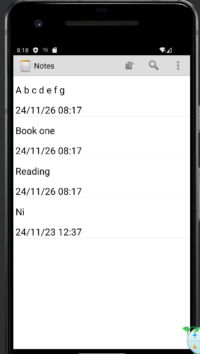

2.搜索功能的添加
2.1在res—menu—list_options_menu.xml布局文件中添加搜索功能，新增menu_search
<item
android:id="@+id/menu_search"
android:icon="@android:drawable/ic_search_category_default"
android:showAsAction="always"
android:title="search">

2.2在res—layout中新建一个查找笔记内容的布局文件note_search.xml
<!--?xml version="1.0" encoding="utf-8"?-->
<LinearLayout xmlns:android="http://schemas.android.com/apk/res/android"
android:layout_width="match_parent"
android:layout_height="match_parent"
android:orientation="vertical">
<SearchView
android:id="@+id/search_view"
android:layout_width="match_parent"
android:layout_height="wrap_content"
android:iconifiedByDefault="false"
/>
<ListView
android:id="@+id/list_view"
android:layout_width="match_parent"
android:layout_height="wrap_content"
/>
</LinearLayout>

2.3在NoteList类中的onOptionsItemSelected方法中新增search查询的处理(跳转)
case R.id.menu_search:
  Intent intent = new Intent();
  intent.setClass(this, NoteSearch.class);
  this.startActivity(intent);
  return true;

2.4新建一个NoteSearch类用于search功能的功能实现
public class NoteSearch extends Activity implements SearchView.OnQueryTextListener
{
ListView listView;
SQLiteDatabase sqLiteDatabase;
/**
* The columns needed by the cursor adapter
*/
private static final String[] PROJECTION = new String[]{
NotePad.Notes._ID, // 0
NotePad.Notes.COLUMN_NAME_TITLE, // 1
NotePad.Notes.COLUMN_NAME_MODIFICATION_DATE//时间
};

    public boolean onQueryTextSubmit(String query) {
        Toast.makeText(this, "您选择的是："+query, Toast.LENGTH_SHORT).show();
        return false;
    }

    @Override
    protected void onCreate(Bundle savedInstanceState) {
        super.onCreate(savedInstanceState);
        setContentView(R.layout.note_search);
        SearchView searchView = (SearchView) findViewById(R.id.search_view);
        Intent intent = getIntent();
        if (intent.getData() == null) {
            intent.setData(NotePad.Notes.CONTENT_URI);
        }
        listView = (ListView) findViewById(R.id.list_view);
        sqLiteDatabase = new NotePadProvider.DatabaseHelper(this).getReadableDatabase();
        //设置该SearchView显示搜索按钮
        searchView.setSubmitButtonEnabled(true);

        //设置该SearchView内默认显示的提示文本
        searchView.setQueryHint("查找");
        searchView.setOnQueryTextListener(this);

    }
    public boolean onQueryTextChange(String string) {
        String selection1 = NotePad.Notes.COLUMN_NAME_TITLE+" like ? or "+NotePad.Notes.COLUMN_NAME_NOTE+" like ?";
        String[] selection2 = {"%"+string+"%","%"+string+"%"};
        Cursor cursor = sqLiteDatabase.query(
                NotePad.Notes.TABLE_NAME,
                PROJECTION, // The columns to return from the query
                selection1, // The columns for the where clause
                selection2, // The values for the where clause
                null,          // don't group the rows
                null,          // don't filter by row groups
                NotePad.Notes.DEFAULT_SORT_ORDER // The sort order
        );
        // The names of the cursor columns to display in the view, initialized to the title column
        String[] dataColumns = {
                NotePad.Notes.COLUMN_NAME_TITLE,
                NotePad.Notes.COLUMN_NAME_MODIFICATION_DATE
        } ;
        // The view IDs that will display the cursor columns, initialized to the TextView in
        // noteslist_item.xml
        int[] viewIDs = {
                android.R.id.text1,
                android.R.id.text2
        };
        // Creates the backing adapter for the ListView.
        SimpleCursorAdapter adapter
                = new SimpleCursorAdapter(
                this,                             // The Context for the ListView
                R.layout.noteslist_item,         // Points to the XML for a list item
                cursor,                           // The cursor to get items from
                dataColumns,
                viewIDs
        );
        // Sets the ListView's adapter to be the cursor adapter that was just created.
        listView.setAdapter(adapter);
        return true;
    }
}
·搜索功能截图
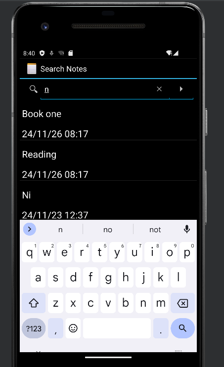
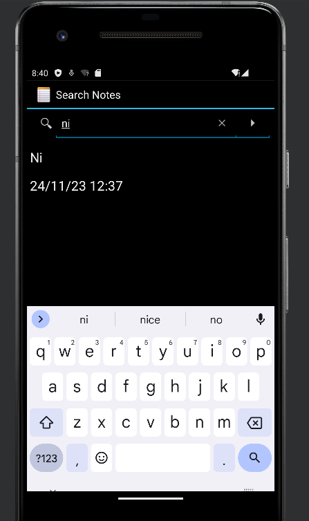

三、扩展功能
1.设置记事本内容字体大小颜色
1.1在editor_options_menu.xml中添加一个条件菜单字体大小，再添加三个子菜单，分别为字体小、中、大
<item
     android:id="@+id/textsize"
     android:title="@string/textsize">
   <menu>
       <item
          android:id="@+id/size1"
          android:title="小"/>
       <item 
          android:id="@+id/size2"
          android:title="中"/>
      <item 
          android:id="@+id/size3"
          android:title="大"/>
</menu>
    </item>

1.2在NoteEditor中的onOptionsItemSelected方法中添加三个case
case R.id.size1:
                mText.setTextSize(10 * 2);
                break;
            case R.id.size2:
                mText.setTextSize(16 * 2);
                break;
            case R.id.size3:
                mText.setTextSize(20 * 2);
                break;

·结果截图
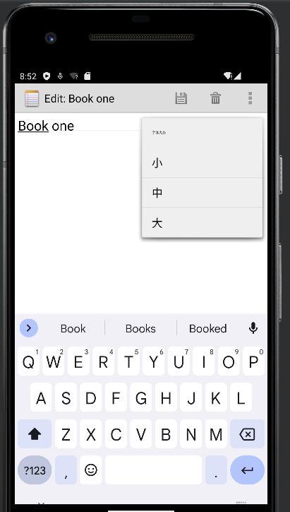
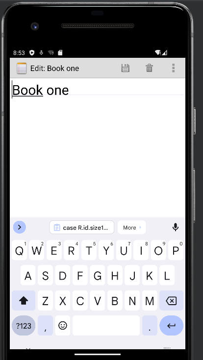
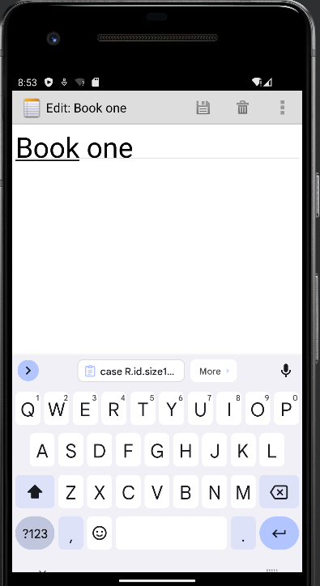

1.3字体颜色，在editor_options_menu.xml中添加三个menu，分别为红色，蓝色和黄色
<item
android:id="@+id/color"
android:title="@string/color" >
<menu>
            <item android:id="@+id/color1"
                android:title="@string/color1"/>
            <item
                android:id="@+id/color2"
                android:title="@string/color2"/>
            <item
                android:id="@+id/color3"
                android:title="@string/color3"/>
</menu>
  </item>

1.4在NoteEditor中的onOptonsItemSelected方法中添加三个case
case R.id.color1:
     mText.setTextColor(Color.RED);
     break;
case R.id.color2:
     mText.setTextColor(Color.BLUE);
     break;
case R.id.color3:
     mText.setTextColor(Color.YELLOW);
     break;
·结果截图
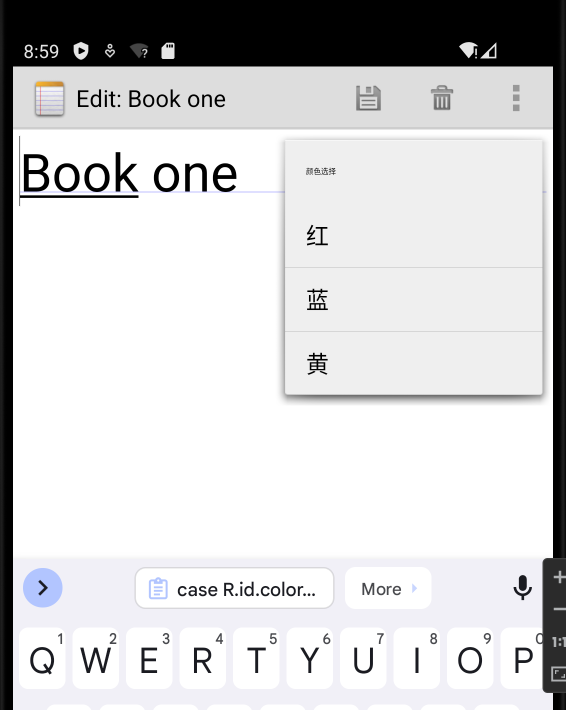
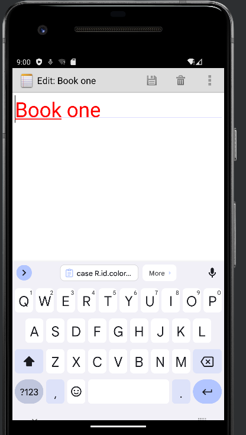

2.文件导出功能
2.1先添加一个导出的按钮，在editor_options_menu.xml中
<item android:id="@+id/menu_output"
android:title="@string/menu_output" />

2.2在NoteEditor中onOptionsItemSelected()方法添加对应的case
case R.id.menu_output:
  outputNote();
  break;

2.3在NoteEditor中添加outputNote()函数
private final void outputNote() {
  Intent intent = new Intent(null,mUri);
  intent.setClass(NoteEditor.this,OutputText.class);
  NoteEditor.this.startActivity(intent);
}

2.4创建OutputText
public class OutputText extends Activity {
private static final String[] PROJECTION = new String[] {
NotePad.Notes._ID, // 0
NotePad.Notes.COLUMN_NAME_TITLE, // 1
NotePad.Notes.COLUMN_NAME_NOTE, // 2
NotePad.Notes.COLUMN_NAME_CREATE_DATE, // 3
NotePad.Notes.COLUMN_NAME_MODIFICATION_DATE, // 4
};
private String TITLE;
private String NOTE;
private String CREATE_DATE;
private String MODIFICATION_DATE;
private Cursor mCursor;
private EditText mName;
private Uri mUri;
private boolean flag = false;
private static final int COLUMN_INDEX_TITLE = 1;
public void onCreate(Bundle savedInstanceState) {
super.onCreate(savedInstanceState);
setContentView(R.layout.output_text);
mUri = getIntent().getData();
mCursor = managedQuery(
mUri,
PROJECTION,
null,
null,
null
);
mName = (EditText) findViewById(R.id.output_name);
}
@Override
protected void onResume(){
super.onResume();
if (mCursor != null) {
mCursor.moveToFirst();
mName.setText(mCursor.getString(COLUMN_INDEX_TITLE));
}
}
@Override
protected void onPause() {
super.onPause();
if (mCursor != null) {
TITLE = mCursor.getString(mCursor.getColumnIndex(NotePad.Notes.COLUMN_NAME_TITLE));
NOTE = mCursor.getString(mCursor.getColumnIndex(NotePad.Notes.COLUMN_NAME_NOTE));
CREATE_DATE = mCursor.getString(mCursor.getColumnIndex(NotePad.Notes.COLUMN_NAME_CREATE_DATE));
MODIFICATION_DATE = mCursor.getString(mCursor.getColumnIndex(NotePad.Notes.COLUMN_NAME_MODIFICATION_DATE));
if (flag == true) {
write();
}
flag = false;
}
}
public void OutputOk(View v){
flag = true;
finish();
}
private void write()
{
try
{
if (Environment.getExternalStorageState().equals(
Environment.MEDIA_MOUNTED)) {
File sdCardDir = Environment.getExternalStorageDirectory();
File targetFile = new File(sdCardDir.getCanonicalPath() + "/" + mName.getText() + ".txt");
PrintWriter ps = new PrintWriter(new OutputStreamWriter(new FileOutputStream(targetFile), "UTF-8"));
ps.println(TITLE);
ps.println(NOTE);
ps.println("创建时间：" + CREATE_DATE);
ps.println("最后一次修改时间：" + MODIFICATION_DATE);
ps.close();
Toast.makeText(this, "导出成功,保存位置：" + sdCardDir.getCanonicalPath() + "/" + mName.getText() + ".txt", Toast.LENGTH_LONG).show();
}
}
catch (Exception e)
{
e.printStackTrace();
}
}
}

2.5创建output_text.xml
<?xml version="1.0" encoding="utf-8"?>

<LinearLayout xmlns:android="http://schemas.android.com/apk/res/android"
    android:layout_width="wrap_content"
    android:layout_height="wrap_content"
    android:orientation="vertical"
    android:paddingLeft="6dip"
    android:paddingRight="6dip"
    android:paddingBottom="3dip">
    <EditText android:id="@+id/output_name"
        android:maxLines="1"
        android:layout_marginTop="2dp"
        android:layout_marginBottom="15dp"
        android:layout_width="wrap_content"
        android:ems="25"
        android:layout_height="wrap_content"
        android:autoText="true"
        android:capitalize="sentences"
        android:scrollHorizontally="true" />
<Button android:id="@+id/output_ok"
        android:layout_width="wrap_content"
        android:layout_height="wrap_content"
        android:layout_gravity="right"
        android:text="@string/output_ok"
        android:onClick="OutputOk" />
</LinearLayout>
2.6在AndroidManifest.xml中将这个Acitvity主题定义为对话框样式，并且加入权限
<activity android:name="OutputText"
android:label="@string/output_name"
android:theme="@android:style/Theme.Holo.Dialog"
android:windowSoftInputMode="stateVisible">
</activity>
    </application>
    <!-- 在SD卡中创建与删除文件权限 -->
    <uses-permission android:name="android.permission.MOUNT_UNMOUNT_FILESYSTEMS"
        tools:ignore="ProtectedPermissions" />
    <!-- 向SD卡写入数据权限 -->
    <uses-permission android:name="android.permission.WRITE_EXTERNAL_STORAGE"/>

·导出截图
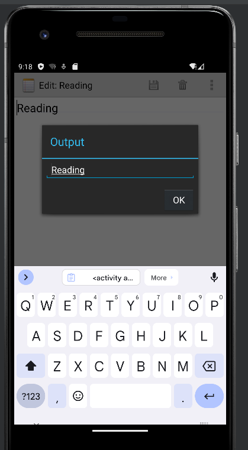
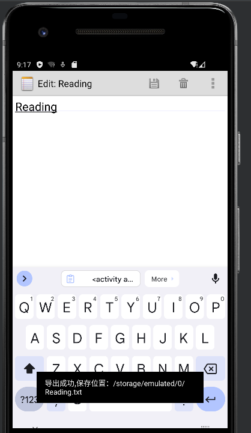
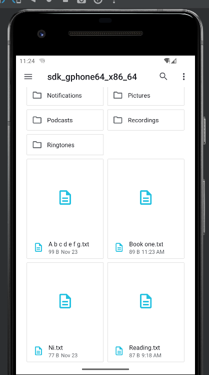
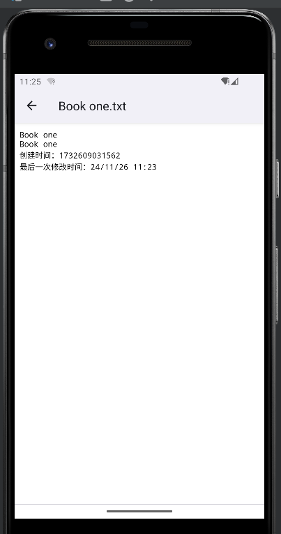